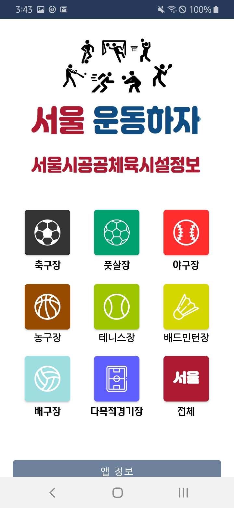
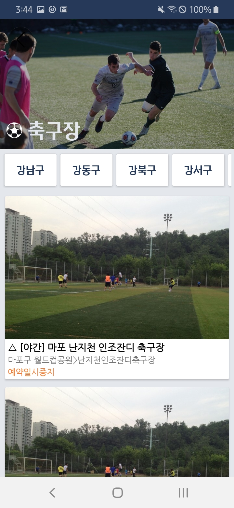
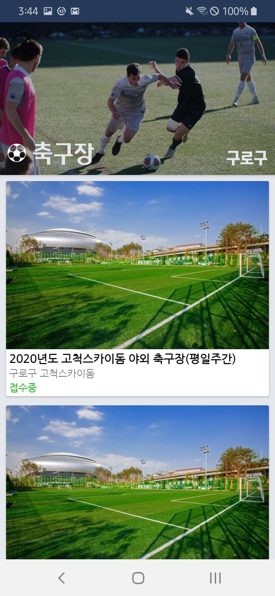
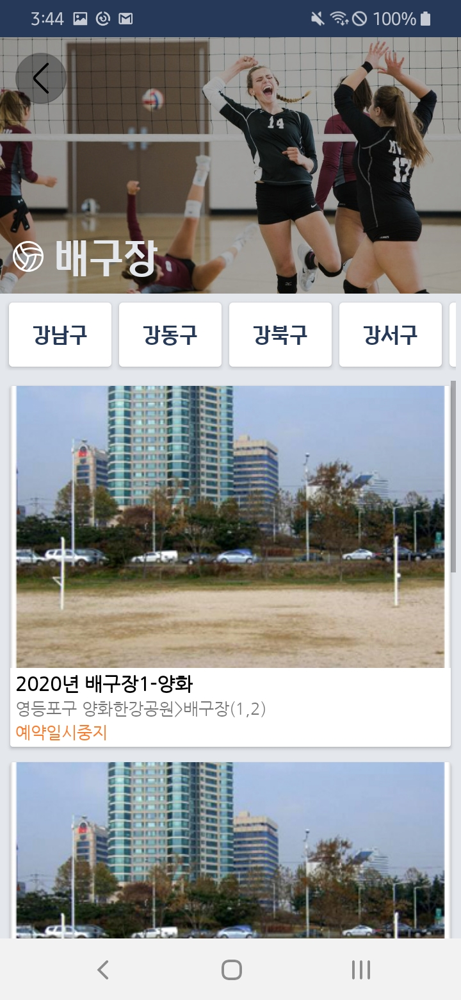
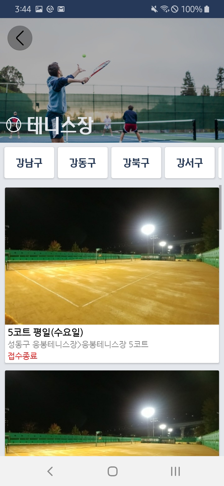
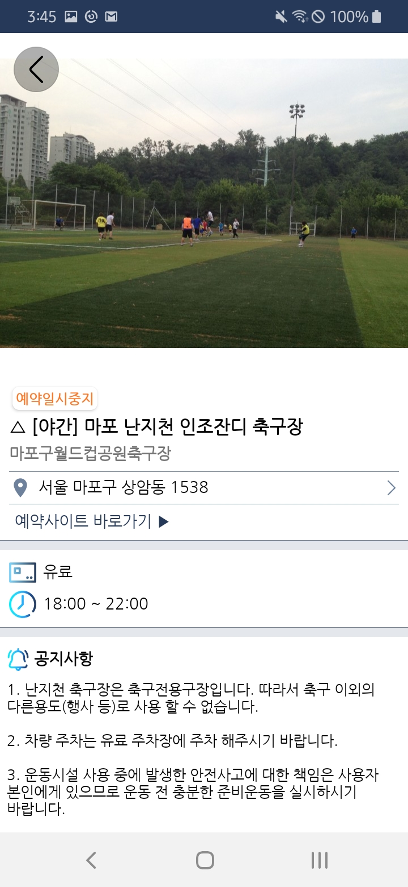
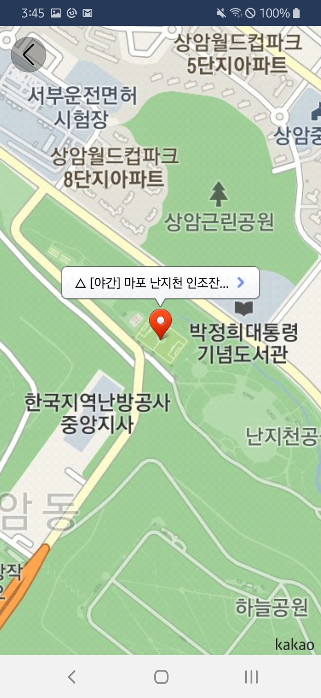

# Seoul, Let's Exercise! 서울 운동하자
서울시 공공체육시설 정보 제공 안드로이드 어플리케이션

### Download App on Google Play
출시 예정

### Screenshots

  
  
  
  
  
  
  
  

### 사용된 기술 스택
 - Kotlin
 - MVVM Architectural Pattern
 - library for Pagination
 - RxJava
 - Retrofit
 - Glide
 - Kakao 지도 API

### Architecture

 
### 주요 기능
 - 서울시 공공체육시설에 대한 모든 정보 (예약(접수)가능 여부, 주소, 예약 사이트 링크, 이미지 등)
 - 체육종목, 자치구 별 필터링
 - 공공체육시설의 위치 (Kakao Map)
 - 예약 사이트로 이동(모바일 웹 화면으로)